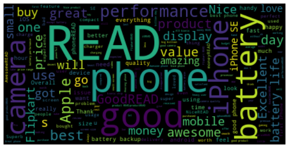

# iPhone SE(MVP)

## Goal :
- The primary goal of the project is if the customer satisfied about the iphone SE for AppleCO

## Workflow:

- EDA, to find anomalies in the data such as nulls
- Remove stop words , Remove HTML tags and URLs from a string , Remove the most frequent words , Remove numbers and characters

## Findings

- The above figure shows the most used words

